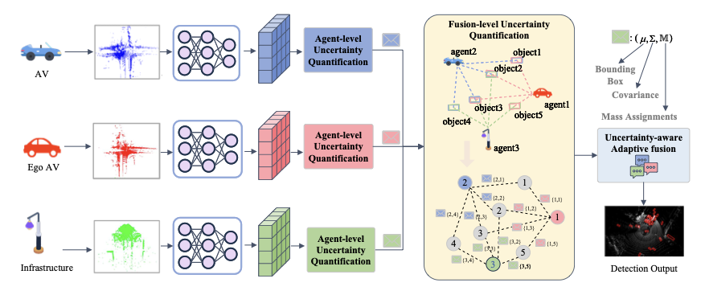

# BELT-Fusion: Bayesian Evidential Late Fusion for Trustworthy V2X Perception

[](LICENSE)
[](https://www.python.org/downloads/)
[](https://pytorch.org/)

**BELT-Fusion** is a unified probabilistic framework for trustworthy V2X late fusion that jointly models classification and regression uncertainties, enabling robust collaborative perception in uncertain environments.

## 📖 Overview

Vehicle-to-Everything (V2X) collaborative perception enhances autonomous vehicles by mitigating occlusion and extending sensing range. However, existing methods often overlook inherent uncertainties from localization errors, asynchronous measurements, and heterogeneous agent models.

**BELT-Fusion** addresses this challenge with two key innovations:

1. **Agent-level uncertainty modeling**: Decouples classification uncertainty (via evidential deep learning) and regression uncertainty (via Bayesian Neural Networks), enabling task-specific reliability estimation that can be plugged into existing object detectors.

2. **Uncertainty-aware adaptive fusion**: Dynamically guides object selection and weight allocation based on quantified fusion-level uncertainty, ensuring trustworthy fusion results without retraining (plug-and-play).

<p align="center">
  
  <br/>
  <em>Figure: Overall architecture of the BELT-Fusion framework.</em>
</p>

## 🔑 Key Features

- **Dual Uncertainty Quantification**: Simultaneously models epistemic (classification) and aleatoric (regression) uncertainties
- **Plug-and-Play**: Easily integrates with existing 3D detectors (PointPillars, SECOND, VoxelNet)
- **No Retraining Required**: The fusion module works without retraining the base detector
- **Real-Time Performance**: Minimal computational overhead (~8ms) while significantly improving accuracy
- **Robust to Noise**: Superior performance in noisy environments with localization errors and time delays

## 📊 Main Results

### DAIR-V2X Dataset (Noisy Setting)

| Method | AP@0.5 | AP@0.7 | Improvement |
|--------|--------|--------|-------------|
| LateFusion-PointPillars | 0.492 | 0.433 | - |
| **BELT-Fusion-PointPillars*** | **0.552** | **0.481** | **+12.20% / +11.09%** |
| LateFusion-SECOND | 0.466 | 0.405 | - |
| **BELT-Fusion-SECOND*** | **0.491** | **0.426** | **+5.36% / +5.19%** |

### OPV2V Dataset (Noisy Setting)

| Method | AP@0.5 | AP@0.7 | Improvement |
|--------|--------|--------|-------------|
| LateFusion-PointPillars | 0.662 | 0.414 | - |
| **BELT-Fusion-PointPillars*** | **0.724** | **0.447** | **+9.37% / +7.97%** |

*Results show mean Average Precision at different IoU thresholds. Experiments conducted with 0.2m position noise, 0.2° heading noise, and 100ms time delay.*

## 🏗️ Installation

### Requirements

```bash
# Create conda environment
conda create -n belt-fusion python=3.8 -y
conda activate belt-fusion

# Install PyTorch (adjust CUDA version as needed)
pip install torch==1.9.0 torchvision==0.10.0 cudatoolkit=11.1

# Install dependencies
pip install -r requirements.txt

# Install BELT-Fusion
pip install -e .
```

### Dependencies

See [`requirements.txt`](requirements.txt) for the full list of dependencies.

## 🚀 Quick Start

### 1. Data Preparation

#### DAIR-V2X

Download the [DAIR-V2X dataset](https://thudair.baai.ac.cn/index) and organize it as follows:

```
data/
└── DAIR-V2X/
    ├── v2x-cooperative/
    │   ├── image/
    │   ├── pointcloud/
    │   └── label/
    └── v2x_infos_train.pkl
    └── v2x_infos_val.pkl
```

#### OPV2V

Download the [OPV2V dataset](https://opv2v.ai-torus.com/) and organize similarly.

### 2. Training

Train BELT-Fusion with PointPillars backbone on DAIR-V2X:

```bash
# Single GPU training
python tools/train.py \
    --dataset dair-v2x \
    --data-root data/DAIR-V2X/ \
    --ann-file data/DAIR-V2X/v2x_infos_train.pkl \
    --backbone PointPillars \
    --epochs 50 \
    --batch-size 4 \
    --work-dir ./work_dirs/belt_fusion_dair

# Multi-GPU training (8 GPUs)
./tools/dist_train.sh configs/belt_fusion_pointpillars_dairv2x.py 8 \
    --work-dir ./work_dirs/belt_fusion_dair
```

### 3. Evaluation

Evaluate a trained model:

```bash
python tools/test.py \
    --config configs/belt_fusion_pointpillars_dairv2x.py \
    --checkpoint work_dirs/belt_fusion_dair/checkpoint_epoch_50.pth \
    --data-root data/DAIR-V2X/ \
    --ann-file data/DAIR-V2X/v2x_infos_val.pkl \
    --eval-metric bbox
```

### 4. Inference with Uncertainty Visualization

```bash
python tools/demo.py \
    --config configs/belt_fusion_pointpillars_dairv2x.py \
    --checkpoint work_dirs/belt_fusion_dair/checkpoint_epoch_50.pth \
    --input data/sample/ \
    --show-dir vis_results/
```

## 📦 Model Zoo

| Backbone | Dataset | Config | Checkpoint | AP@0.5 | AP@0.7 |
|----------|---------|--------|------------|--------|--------|
| PointPillars | DAIR-V2X | [config](configs/belt_fusion_pointpillars_dairv2x.py) | [model]() | 0.552 | 0.481 |
| PointPillars | OPV2V | [config](configs/belt_fusion_pointpillars_opv2v.py) | [model]() | 0.724 | 0.447 |
| SECOND | DAIR-V2X | [config]() | [model]() | 0.491 | 0.426 |
| VoxelNet | DAIR-V2X | [config]() | [model]() | 0.468 | 0.405 |

*Checkpoints will be uploaded soon.*

## 🔧 Usage Guide

### Integrating with Your Detector

BELT-Fusion's probabilistic head can replace standard detection heads:

```python
from belt_fusion.models import ProbabilisticDetectionHead

# Create probabilistic head
prob_head = ProbabilisticDetectionHead(
    in_channels=256,      # From your backbone
    num_classes=3,        # Car, Pedestrian, Cyclist
    num_regs=7            # 3D bbox parameters
)

# Forward pass
outputs = prob_head(features)

# outputs contains:
# - reg_mean: Regression predictions
# - reg_log_var: Regression uncertainty (log-variance)
# - evidence: Classification evidence
# - alpha: Dirichlet parameters
# - cls_uncertainty: Classification uncertainty
```

### Using the Fusion Module

```python
from belt_fusion.models import UncertaintyAwareAdaptiveFusion

# Initialize fusion module
fusion = UncertaintyAwareAdaptiveFusion(
    num_classes=3,
    score_threshold=0.3,
)

# Prepare detections from multiple agents
agent_detections = [
    {
        'boxes': boxes_1,        # (N, 7)
        'scores': scores_1,      # (N, 3)
        'covariances': cov_1,    # (N, 7, 7)
        'evidence': evidence_1,  # (N, 3)
    },
    {
        'boxes': boxes_2,
        'scores': scores_2,
        'covariances': cov_2,
        'evidence': evidence_2,
    },
]

# Fuse predictions
fused_results = fusion(agent_detections)
```

## 📐 Method Details

### Agent-Level Uncertainty

**Regression Uncertainty**: Models bounding box regression as heteroscedastic Gaussian:
$$L_{\text{reg}} = \frac{1}{2} e^{-s} \| y_{gt} - u \|^2 + \frac{1}{2} s$$
where $s = \log(\sigma^2)$ is the predicted log-variance.

**Classification Uncertainty**: Uses evidential deep learning with Dirichlet distributions:
$$u = \frac{K}{S}, \quad b_k = \frac{e_k}{S}, \quad S = \sum_{i=1}^{K}(e_i + 1)$$
where $u$ is uncertainty, $b_k$ is belief mass, and $e_k$ is evidence.

### Fusion-Level Uncertainty

**Dempster-Shafer Fusion**: Combines classification beliefs from multiple agents:
$$b_k = \frac{b_k^1 b_k^2 + b_k^1 u_2 + b_k^2 u_1}{1 - C}$$
$$u = \frac{u_1 u_2}{1 - C}$$
where $C$ is the conflict factor.

**Regression Uncertainty**: Uses Mahalanobis distance to measure discrepancy between Gaussian predictions.

## 📝 Citation

If you find BELT-Fusion useful in your research, please cite our paper:

```bibtex
@article{zhao2024beltfusion,
  title={BELT-Fusion: Bayesian Evidential Late Fusion for Trustworthy V2X Perception},
  author={Zhao, Zhiguo and Zhao, Cong and Chen, Kun and Ji, Yuxiong and Du, Yuchuan},
  journal={IEEE Transactions on Intelligent Transportation Systems},
  year={2024}
}
```

## 🤝 Contributing

We welcome contributions! Please feel free to submit Pull Requests.

1. Fork the repository
2. Create your feature branch (`git checkout -b feature/amazing-feature`)
3. Commit your changes (`git commit -m 'Add amazing feature'`)
4. Push to the branch (`git push origin feature/amazing-feature`)
5. Open a Pull Request

## 📄 License

This project is licensed under the MIT License - see the [LICENSE](LICENSE) file for details.

## 👥 Authors

- **Zhiguo Zhao** - Key Laboratory of Road and Traffic Engineering, Tongji University
- **Cong Zhao** (Corresponding author) - Key Laboratory of Road and Traffic Engineering, Tongji University
- **Kun Chen** - Key Laboratory of Road and Traffic Engineering, Tongji University
- **Yuxiong Ji** (Corresponding author) - Key Laboratory of Road and Traffic Engineering, Tongji University
- **Yuchuan Du** - Key Laboratory of Road and Traffic Engineering, Tongji University

## 🙏 Acknowledgments

This work was supported by:
- National Key Research and Development Program of China (Grant 2022YFF0604900)
- National Natural Science Foundation of China (Grant 52472352)
- Shanghai Rising-Star Program (Grant 24QA2709600)
- Shanghai Municipal Science and Technology Major Project (Grant 2021SHZDZX0100)

We thank the authors of OpenPCDet, MMDetection3D, and other open-source projects that made this work possible.

## 📬 Contact

For questions or collaborations, please contact:
- Zhiguo Zhao: zhc@tongji.edu.cn
- Prof. Yuxiong Ji: yxji@tongji.edu.cn

## 🔗 Links

- [Paper (arXiv)](https://arxiv.org/)
- [DAIR-V2X Dataset](https://thudair.baai.ac.cn/index)
- [OPV2V Dataset](https://opv2v.ai-torus.com/)
- [Project Page](https://github.com/ZhiguoZhao/BELT-Fusion)
